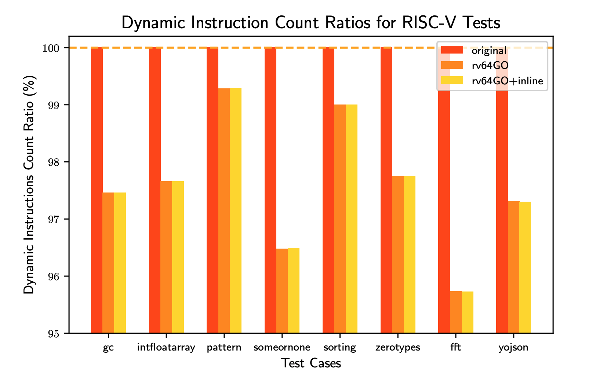

OCaml RISC-V Extension
----------------------

The accompanying pdf (`diss.pdf`) contains my dissertation "Optimisations across Software and Hardware using RISC-V" for my computer science degree from Cambridge. The TL;DR is I added custom instructions to [RISC-V](https://riscv.org/) specifically designed to improve OCaml programs compiled to RISC-V.  

> This dissertation looks at how an open-source specification for a modular, flexible, reduced instruction set architecture, RISC-V, can open doors to greater control and manipulation over the hardware-software interface... we can achieve faster and more power-efficient computers simultaneously...

There were many tools modified to make it all happen: 
  - [Spike the RISC-V ISA Simulator](https://github.com/patricoferris/riscv-isa-sim/tree/rv64GO)
  - [GNU Binutils](https://github.com/patricoferris/riscv-binutils-gdb/tree/rv64GO)
  - [The port of the OCaml compiler](https://github.com/patricoferris/riscv-ocaml/tree/rv64GO) because at the time RISC-V hadn't been upstreamed. 
  - [Some specific benchmarks](https://github.com/patricoferris/riscv-benchmarks)
  - [A Spike Analysis Tool](https://github.com/patricoferris/ospike)

Please, if you so wish, re-use any of the work. 

## TL;DR 

OCaml uses a tagged-bit runtime representation to distinguish between pointers and immediate values (like an int or constant constructors for variants). The LSB is a `1` for immediate values and `0` for pointers. This means `1 + 2` is really `3 + 5` but instead of getting `7` (`2 * 3 + 1`) you get `8` you have to have an additional subtraction to get the correct value! Two instructions for a single addition (or subtraction!). So I proposed `ocadd` to do it all in one. 

One of OCaml's greatest features is pattern-matching: 

```ocaml
type animal = Dog | Cat | Camel
let print_animal = function 
  | Dog -> print_endline "dog"
  | Cat -> print_endline "cat"
  | Camel -> print_endline "camel"
```

Seeing as these constructors are representedat runtime as immediates (an enumeration using odd numbers `1, 3, 5...`) long enough pattern-matches are converted into jump tables using this enumeration to index the right address (see p.24). These addresses (of the jumps) are separated by four bytes so we use the enumeration to do the jump by first converting to `0, 1, 2...` and then shifting left twice (multipying by 4) and finally adding it to a base address. This is quite common so fuse these into one shift-and-add instruction `oclea` after *load-effective address*.

Another common task (especially with so many functions (curried or not)) is applying functions. This can require saving or loading the return address and moving stack pointer -- so-call function prologues and epilogues. These were combined into one instruction also. 

As mentioned, OCaml has a tagged-bit representation. It is quite common to turn a number into an OCaml value by shifting left and adding one - `ocvali` does this in one go. `oceqi r1 r2 imm` checks if `r2` is equal to `imm` and assigns `1` to `r1` if it is, otherwise `0`. This is is useful in OCaml because the `true` value is a `1` which is really a `3`! So simple truth checking looks like: 

```
L101:
  li a1, 1
  beq a0, a1, L100  
  li a0, 1          
  ret
L100:
  li a0, 3 
  ret
```

Some results:



## Future Work 

This has only scratched the surface of what is possible. Better custom instructions, MirageOS running on RISC-V... all very exciting! 

## A Note on the quality of work 

In the spirit of being open, especially for other Cambridge students, this dissertation scored `68/100`. Make of that what you will. 

I tried to get more feedback so I could improve and learn, but was told "...unfortunately the Cambridge system doesn't allow for feedback on final results". Make of that what you will... I learned a lot, enjoyed it and the feedback from my supervisor (and friends) was great. 
